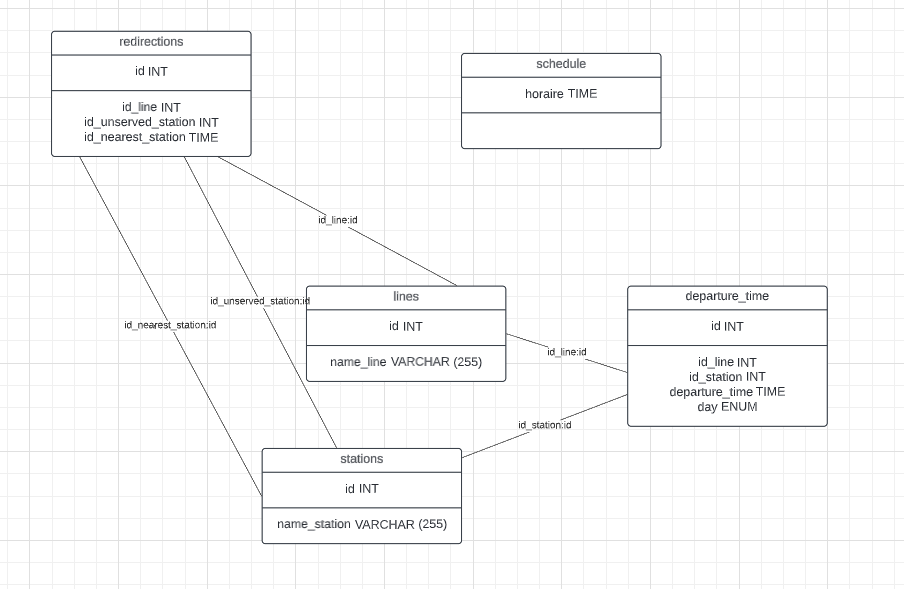

# Projet_SQL_B3_bus
modéliser une partie de la base de données de la société Kicéo, en charge des transports en commun de Vannes. La base de données doit permettre de mémoriser et retrouver les horaires de toutes les lignes de bus de la ville.

# Table des matières

- [Installation et Utilisation](#installation-et-utilisation)
- [Conception](#conception)
- [Référence](#référence)

## Installation et Utilisation

Prérequis: avoir installé MySQL

1. **Cloner le repository dans le répertoire de votre choix :**
    ```bash
    git@github.com:BaptisteO1/Projet_SQL_B3_bus.git

2. **ouvrez Visual Studio Code et dans le dossier du projet**
    ```bash
    cd Projet_SQL_B3_bus
    code .

3. **Retournez sur le terminal et ouvrez le terminal MySQL avec la commande:**
    ```bash
    mysql -u "nom de votre utilisateur" -p

4. **Créez la structure de base de donnée**
    ```bash
    mysql -u username -p < schema.sql


5. **Ajoutez les données dans la base de donnée**
    ```bash
    mysql -u username -p < data.sql


6. **Créer les queries**
    ```bash
    mysql -u username -p < queries.sql

## Conception

**Conception MCD**
    
